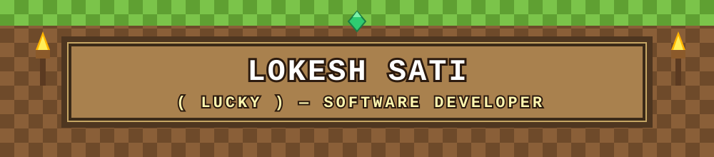

<p align="center">
  
</p>

<p align="center">
  
</p>

<p align="center">
  
</p>


## ⛏️ ABOUT ME

```
> BCA Graduate (2026) — Amrapali Institute of Technology, Kumaun University
> Software Developer | Open to Work
> Building RealEye — deepfake & fake-news detection
> Currently crafting my portfolio site (GSAP animations)
```


## 🧱 INVENTORY (Tech Stack)

<table align="center">
<tr>
<td align="center" width="96">
<br><b>Python</b>
</td>
<td align="center" width="96">
<br><b>Flask</b>
</td>
<td align="center" width="96">
<br><b>FastAPI</b>
</td>
<td align="center" width="96">
<br><b>React</b>
</td>
<td align="center" width="96">
<br><b>JavaScript</b>
</td>
</tr>
<tr>
<td align="center" width="96">
<br><b>Tailwind</b>
</td>
<td align="center" width="96">
<br><b>PostgreSQL</b>
</td>
<td align="center" width="96">
<br><b>Git</b>
</td>
<td align="center" width="96">
🔗<br><b>REST API</b>
</td>
<td></td>
</tr>
</table>


## 💎 FEATURED BUILD

**[RealEye](https://github.com/lokesh-sati-2005)** — Deepfake & fake-news detection system fighting misinformation.


## 📊 STATS (XP Bar)

<p align="center">
  
  
</p>

<p align="center">
  
</p>


## 🐍 LIVE ACTIVITY (Contribution Snake)

<p align="center">
  
</p>


## 📫 SPAWN POINT (Contact)

<p align="center">
  <a href="mailto:lokeshsati1006@gmail.com"></a>
  <a href="https://github.com/lokesh-sati-2005"></a>
</p>

<p align="center"><i>🎮 Thanks for visiting my world — let's build something legendary.</i></p>
